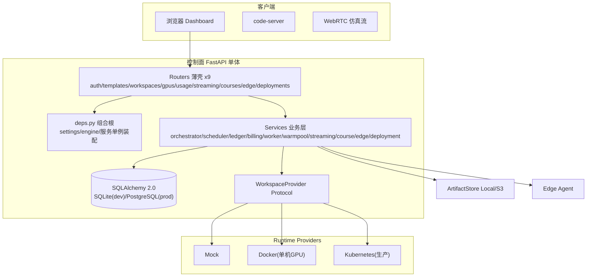

# EmbodiedCloud 仓库系统性走读 · 最终审查报告

> **⚠️ 历史快照**：本文是 2026-08-13 对 v0.3.0 的审查记录。文中所列 P0/P1/P2 缺陷绝大多数已在后续提交（b02811a → 05a2643 以及 v0.4.0 迭代）修复并附回归测试；行号也已漂移。作为当时审查的历史证据保留，最新状态以代码、`docs/CURRENT_STATE.md` 与 `docs/ACCEPTANCE_GATES.md` 为准。

> 审查日期：2026-08-13
> 审查团队：软件开发团队（主理人 齐活林 · 架构师 高见远 · 工程师 寇豆码）
> 审查对象：`/Volumes/Extra/CodeProj/Embodied Cloud`（v0.3.0，FastAPI 单体控制面）
> 审查范围：`app/` 全部 39 个 py（约 6770 行）、`alembic/` 10 级迁移链、`deploy/`、`runtime/`、`scripts/`、`tests/` 38 个测试文件、`docs/`（含 ADR）
> 分部报告：`docs/review/architecture-walkthrough-2026-08-13.md`（架构）、`docs/review/code-quality-review-2026-08-13.md`（实现）

---

## 1. 执行摘要

EmbodiedCloud 是一个**工程成熟度显著高于行业均值的 FastAPI 单体控制面**：分层清晰（Router 薄壳 → Service 业务 → Provider 运行时抽象）、三个 Protocol 抽象（WorkspaceProvider / ArtifactStore / RobotDriver）可离线单测、GPU 单一权威 + 不可变账本 + DB-backed lease/fencing 任务队列 + 模板不可变版本化 + owner/org 隔离统一 404，几乎所有非平凡决策都有 ADR/设计文档段落号锚定。

**未发现架构级 P0 缺陷、未发现模块级循环依赖**。但实现层发现 **2 项 P0 正确性缺陷**（均为「清理失败被当成成功」的变体，可导致 GPU 一卡双跑），以及 10 项 P1、18 项 P2。问题分布呈现一个清晰主题：**正确性设计强（并发/幂等/隔离），失败路径反馈弱（静默吞错/硬编码逃逸/部署清单脱节）**。

问题统计（整合去重后）：

| 级别 | 数量 | 主题 |
|---|---|---|
| P0 严重 | 2 | GPU 双分配竞态、Docker 清理静默失败 |
| P1 重要 | 10 | 丢账、DI 分叉、计费口径、warmpool 阻塞、显存换算、生产清单脱节 |
| P2 建议 | 18 | 重复代码、死代码、测试缺口、安全加固 |

---

## 2. 项目整体架构

### 2.1 产品定位

「浏览器优先的 Isaac Lab 云 GPU 工作区」控制面：用户选 Golden Template → 云端拉起带 GPU 的 Isaac Lab 工作区（浏览器版 code-server）→ 训练 → 停止结算 → 可选把 checkpoint 打包校验后部署到真机边缘代理（Sim2Real）。

### 2.2 技术栈与入口

- Python ≥3.12；FastAPI + uvicorn；SQLAlchemy 2.0 + Alembic；pydantic-settings；kubernetes client；cryptography（Fernet）；prometheus-client
- 入口收敛：`make dev` / `embodiedcloud` CLI → `app.main:app`；容器 `python -m app.main`
- 启动链路：`deps.py` 组合根模块级装配全部单例 → FastAPI 装配（RequestIDMiddleware + 9 路由）→ lifespan（bootstrap_db + crash recovery + worker.start + 5s Gauge 循环）

### 2.3 架构图

### 2.4 核心设计支柱（质量亮点）

| 支柱 | 实现 | 位置 |
|---|---|---|
| GPU 单一权威 | 分配只发生在 `GpuScheduler.allocate`（FOR UPDATE skip_locked + 唯一约束兜底），provider 只执行 `ResourceReservation`，禁止自选 GPU | `services/scheduler.py` |
| 不可变账本 | append-only，永不 UPDATE/DELETE；`idempotency_key` 唯一约束防重复扣费；同运行段只结算一次 | `services/ledger.py` |
| DB-backed 任务队列 | operation 持久化 + 原子 claim（rowcount==1）+ lease 60s/心跳 15s + fencing_token 防双终态 | `services/worker.py` |
| 模板不可变版本化 | TemplateVersion 分离 + `current_version_id` 确定性指针（不用 created_at 猜 latest） | `models.py` |
| owner/org 隔离 | 全资源租户隔离，越权统一 404 | 各 router |
| 凭据安全 | PBKDF2-SHA256 600k 迭代；session 只存 token_hash；workspace 凭据 Fernet 加密落库、fail-closed 解密；生产未配置密钥拒绝启动 | `security.py` |
| 离线可测 | 三个 Protocol + `tests/k8s_fakes.py` fake client 注入，无真实集群可全量单测 | `providers/base.py` 等 |

### 2.5 数据模型与迁移

21 张表（身份/模板/工作区/GPU/账本/操作队列/流式/课程/部署边缘），全 UUID 主键，状态用 StrEnum。关键并发约束：`gpu_allocations.workspace_id` 唯一、`gpus.workspace_id` 唯一（一 workspace 至多一卡）、`uq_ops_active_per_workspace` 部分唯一索引（SQLite/PostgreSQL 双 where 语义一致）。10 级线性迁移链演进主线：完整领域模型 → 持久化任务队列 + lease/fencing → soft delete → 模板版本化 → warm pool → 对象存储化 → 边缘租户归属。

---

## 3. 模块职责表

| 模块 | 职责 | 关键设计 |
|---|---|---|
| `main.py` | 应用装配、lifespan、路由注册 | bootstrap + crash recovery + worker 启动 |
| `deps.py` | 组合根，集中装配全部单例 | 消除 router 循环导入 |
| `config.py` | Settings（env 前缀 EMBODIEDCLOUD_） | 类型化配置 + 生产安全校验 |
| `models.py` | 21 表 ORM + 8 状态枚举 | 并发唯一约束是正确性第二道防线 |
| `orchestrator.py` | Workspace 生命周期编排（系统心脏） | 补偿事务；reconcile DB→runtime 收敛 |
| `scheduler.py` | GPU inventory/原子分配/释放/恢复 | 单一 GPU 决策点 |
| `ledger.py` | 不可变账本 | 幂等键防重复扣款 |
| `billing.py` | 启动门禁 + 课程配额 | 个人+组织余额、预授权 |
| `worker.py` | DB-backed operation 队列 | lease/fencing 全文最扎实一段 |
| `warmpool.py` | 预热池 + 原子 claim + 凭据轮换补偿 | claim 失败零孤儿 |
| `streaming.py` | WebRTC 会话状态机 | 合法迁移表驱动 |
| `course.py` | 课程/实验/作业/提交 | 教师/学生权限模型 |
| `edge.py` / `deployment.py` | 边缘代理 + Sim2Real 部署状态机 | checksum 防绕过/防 replay |
| `providers/` | Mock/Docker/K8s 三实现 | 契约：ResourceReservation 是唯一 GPU 决策来源 |

**依赖方向**：routers → services → models/db/config，自顶向下，无反向依赖、无循环依赖（orchestrator→worker 单向注入、warmpool TYPE_CHECKING、k8s 懒加载）。

---

## 4. 核心调用链路（3 条）

1. **创建启动**：POST /api/workspaces → BillingPolicy 门禁（402）→ warm pool claim（命中）或 enqueue PROVISION → worker 原子 claim → scheduler.allocate（唯一 GPU 决策）→ provider.provision → wait_ready（120s 门禁，失败补偿 destroy+release）→ 凭据加密落库 → RUNNING。
2. **停止结算**：POST /stop → enqueue + 快路径 tick → streaming 终结 → runtime.stop → 按真实秒数结算（幂等键 `usage:{id}:{started_at_iso}`）→ GPU 释放 → STOPPED。全幂等可重试。
3. **Sim2Real 部署**：create_artifact（对象存储 + sha256）→ PENDING → edge download（绝不自动 VERIFIED）→ edge 本地 sha256 → report-checksum（actual==expected 才 VERIFIED，FAILED 不可复活）→ run（只能绑定租户自己的 agent）。

---

## 5. 问题清单（整合去重）

### 5.1 P0 · 严重（2 项，须立即修复）

#### P0-1 GPU 双分配竞态：`recover_stuck_gpu_allocations` 释放仍在 PROVISIONING 的 GPU

- **位置**：`app/services/scheduler.py:197-226`（调用点 `orchestrator.py:459`）
- **问题**：以「workspace 状态 == RUNNING」为唯一有效占用判据，会释放 PROVISIONING（已分配、建容器中）/STOPPING（已分配、停止中）workspace 的 GPU。该函数在 reconcile_all 末尾无条件调用；多 worker 下 worker A 执行 RECONCILE 时 worker B 正在 PROVISION → GPU 被释放并重新分配 → **同一物理 GPU 同时跑两个 workspace**。
- **影响**：违反项目最高不变式「ONE RESOURCE = ONE SOURCE OF TRUTH」；显存 OOM、训练互踩、计费错误。
- **修复**：只回收「无 active operation」的 workspace 的 GPU，或显式排除 PROVISIONING/STOPPING；补并发回归测试。

#### P0-2 Docker provider 清理静默失败 → 孤儿容器 + GPU 复用

- **位置**：`app/services/providers/docker.py:208-216`
- **问题**：`destroy`/`stop`/`start` 均 `check=False` 且不校验 returncode；`docker rm -f` 真失败（daemon 不可用等）仍标记 DELETED 并释放 GPU。孤儿容器仍持有 `--gpus device=N`，该卡被分配给新 workspace → 同 P0-1 的一卡双跑。K8s provider 已正确区分 404 与其它错误（`k8s.py:313-336`），Docker 未做到。
- **影响**：资源泄漏 + 双分配；「容器不存在」与「删除失败」混淆为成功。
- **修复**：失败且非「No such container」时上抛，阻断 GPU 释放与 DELETED 置位，交由 reconcile 重试；补失败注入测试。

### 5.2 P1 · 重要（10 项）

| # | 问题 | 位置 | 修复方向 |
|---|---|---|---|
| P1-1 | destroy 吞掉结算异常仍置 DELETED → 静默丢账 | `orchestrator.py:339-347` | 结算失败记录 error 标记 + 告警，可审计可补偿 |
| P1-2 | deployments 路由自建第二套 Settings/engine/DI | `routers/deployments.py:20-31` | 修复 deps mypy 问题后回归组合根注入 |
| P1-3 | monitor_runtime_quotas 硬编码 policy 且只算个人余额 | `orchestrator.py:498-516` | 复用注入的 `self.billing`，口径统一个人+组织 |
| P1-4 | warmpool 预热同步阻塞单 worker 循环（分钟级 provision） | `warmpool.py:57-93` | 预热改走 operation 体系或独立限流线程池 |
| P1-5 | warmpool legacy 计数把普通 QUEUED workspace 误计入池 | `warmpool.py:321-335` | legacy 判定加 `user_id IS NULL` 等归属条件 |
| P1-6 | GPU 显存单位换算错误：24GB 卡无法满足 24GB 模板 | `scheduler.py:102` | 统一 GB/MiB 单位，补边界测试（24564 MiB 应满足 24GB） |
| P1-7 | `_fail` 中 release 异常触发 rollback 回退 FAILED 状态 | `orchestrator.py:250-260` | release 独立 try/except，失败记录而非回滚整个会话 |
| P1-8 | 生产清单 AUTO_CREATE_TABLES=true + emptyDir，Pod 重启丢数据 | `deploy/kubernetes/control-plane.yaml:24` 等 | 提供 PostgreSQL + PersistentVolume + migrate-up 生产模板 |
| P1-9 | create_artifact 直读控制面本地 `workspace_root/{id}`，K8s 模式读不到 Pod PVC | `deployment.py:82-91` | 改 edge/workspace 侧上传或 provider `pull_artifact` 契约 |
| P1-10 | SQLite 下 FOR UPDATE/FK 为 no-op，并发正确性被默认配置掩盖 | `alembic` 迁移 c7c6f510d21f 注释 | 文档+CI 明确生产仅 PostgreSQL，关键并发测试跑 PG 容器 |

### 5.3 P2 · 建议（18 项，摘要）

- **重复/死代码**：`utcnow()` 9 处重复定义；`recover_stuck_workspaces` 从未被调用；`_finalize_stop` 与 `_settle_running_segment` 结算逻辑重复；ledger `rate` 变量只进描述文本不参与计费。
- **一致性**：streaming 路由重复装配服务实例；`password` 列 String(128) 对 Fernet 密文余量极紧；生产启动未校验 pepper/auto_create_tables；demo-workspace 端点无鉴权；端口 TOCTOU；k8s 凭据轮换不等待滚动重启完成；course 配额门禁在 provision 重试路径可被绕过；`upsert_submission` 不校验 workspace 归属；日志脱敏只覆盖 extra 不覆盖 message。
- **健壮性**：`course_completions` 三循环 N+1；`create_course`/`deploy` 先查再插无唯一约束兜底；S3 `exists` 吞掉鉴权/网络异常返回 False；reconcile_all O(N) 全表子进程调用；无 Repository 层（当前规模可接受）。
- **测试缺口**：无 P0-1/P0-2/P1-1/P1-6 的回归保护；无 cli.py、RedactingFormatter 脱敏、独立安全专项测试。

---

## 6. 改进建议（按优先级排序的可执行项）

**立即修复（P0）**
1. 修 `recover_stuck_gpu_allocations`：只回收无 active operation 的 workspace 的 GPU + 并发回归测试。
2. 修 Docker destroy/stop 静默失败：区分「不存在（幂等成功）」与「失败（上抛阻断）」，与 K8s 404 语义对齐 + 失败注入测试。

**短期修复（P1）**
3. destroy 结算失败改可审计（记录+告警，不静默丢账）。
4. 收敛 deployments 路由 DI 至组合根。
5. 统一配额监控计费口径（复用 self.billing + 个人/组织余额）。
6. warmpool 预热去阻塞 + legacy 计数修正。
7. 修正 GPU 显存单位换算 + 边界测试。
8. 收窄 `_fail` rollback 粒度。
9. 生产清单改 PostgreSQL + PV + alembic；artifact 接入改上传/拉取契约；CI 关键并发测试跑 PG。

**建议改进（P2）**
10. 收敛重复代码（utcnow、结算逻辑）、清死代码、明确计费费率口径。
11. 补测试：P0/P1 回归、CLI、日志脱敏、安全专项。
12. 安全加固：生产启动校验 pepper/auto_create_tables、demo 端点鉴权、password 列放宽、S3 exists 异常区分、course N+1 与唯一约束兜底。

---

## 7. 审查结论

- 架构质量在「控制面」维度上**上乘**：以正确性优先的设计 + 三重保障（代码 + DB 约束 + 测试），ADR 显式固化刻意设计（盲捕获、单机可信模式），避免后续维护误判。
- 主要风险集中在**「静默失败 → 资源双分配/丢账」**：两处 P0 与丢账 P1-1 都是「清理/结算失败被当成成功」的变体。建议将「provider 清理结果必须显式反馈」提升为与「ONE RESOURCE = ONE SOURCE OF TRUTH」同级的硬约束。
- 账本、warmpool claim、部署校验三大子系统实现可作为同类项目参考实现。
- 从「本地演示可跑」到「多机生产可用」的跨越点：P0-1/P0-2（多 worker 正确性）、P1-8/P1-9（生产清单与 PVC 解耦）、P1-10（PostgreSQL 唯一生产语义）。
