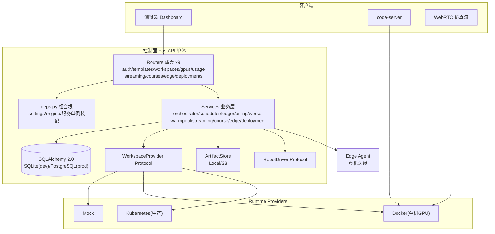
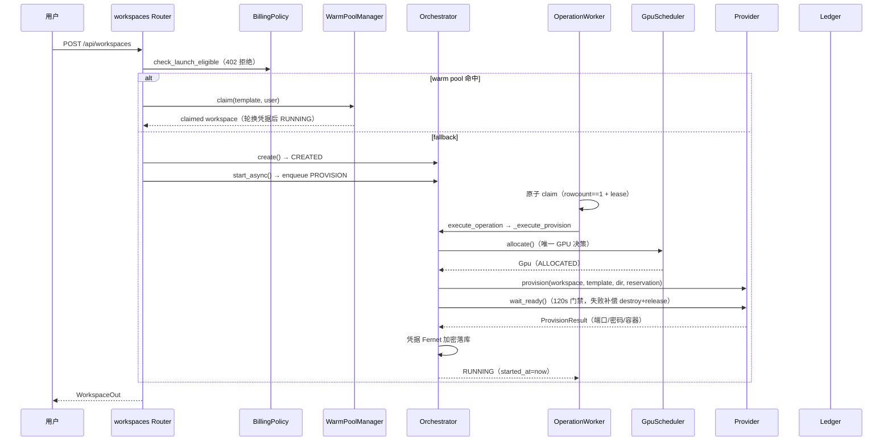
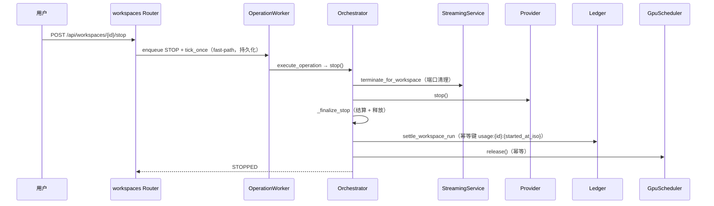
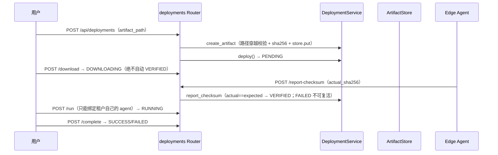

# EmbodiedCloud 全仓库系统性代码走读 · 架构评审报告

> **⚠️ 历史快照**：本文是 2026-08-13 对 v0.3.0 的审查记录。文中所列 P0/P1/P2 缺陷绝大多数已在后续提交（b02811a → 05a2643 以及 v0.4.0 迭代）修复并附回归测试；行号也已漂移。作为当时审查的历史证据保留，最新状态以代码、`docs/CURRENT_STATE.md` 与 `docs/ACCEPTANCE_GATES.md` 为准。


> 审查日期：2026-08-13
> 审查人：高见远（软件架构师）
> 审查对象：`/Volumes/Extra/CodeProj/Embodied Cloud`（v0.3.0，FastAPI 单体控制面）
> 审查范围：`app/` 39 个 py（约 6770 行）、`tests/` 37 个 py（约 6984 行）、`alembic/` 10 级迁移链、`deploy/` 6 份 K8s/Compose 清单、`runtime/` 3 文件、`scripts/` 11 脚本、`docs/`（含 3 份 ADR）
> 审查方式：只读代码，全量走读，未修改任何文件。

---

## 1. 执行摘要

EmbodiedCloud 是一个**工程成熟度显著高于行业均值的 FastAPI 单体控制面**，用于「浏览器优先的 Isaac Lab GPU 工作区」平台。核心分层清晰：Router 薄壳 → Service 业务 → Provider 运行时抽象（Protocol）；三个 Protocol（`WorkspaceProvider` / `ArtifactStore` / `RobotDriver`）可离线单测；几乎所有非平凡设计决策都有 ADR 或文档段落号（`§N`）锚定。

**质量亮点（正确性优先的设计支柱）**：

| 支柱 | 实现要点 |
|---|---|
| GPU 单一权威 | 分配只发生在 `GpuScheduler.allocate`（`FOR UPDATE SKIP LOCKED` + 唯一约束兜底），provider 只执行 `ResourceReservation`，禁止自选 GPU |
| 不可变账本 | `credit_ledger` append-only，永不 UPDATE/DELETE；`idempotency_key` 唯一约束防重复扣费；同运行段幂等结算 |
| DB-backed 任务队列 | `WorkspaceOperation` 持久化 + 原子 claim（rowcount==1）+ lease 60s/心跳 15s + fencing_token 防双终态 |
| 模板不可变版本化 | `TemplateVersion` 分离 + `current_version_id` 确定性指针（不用 created_at 猜 latest） |
| owner/org 隔离 | 全资源租户隔离，越权统一返回 404（不泄露资源存在性） |
| 凭据安全 | PBKDF2-SHA256 600k 迭代；session 仅存 token_hash；workspace 凭据 Fernet 加密落库、fail-closed 解密；生产未配密钥拒绝启动 |

**主要结论**：未发现架构级 P0 缺陷、未发现模块级循环依赖。但实现层存在 **2 项 P0 正确性缺陷**（均为「清理/回收失败被当成成功」的变体，可导致 GPU 一卡双跑），以及 **11 项 P1**、若干 P2。问题分布呈现清晰主题：**正确性设计强（并发/幂等/隔离/补偿），失败路径反馈弱（静默吞错 / 硬编码逃逸 / 部署清单脱节）**。

问题统计：

| 级别 | 数量 | 主题 |
|---|---|---|
| P0 严重 | 2 | GPU 双分配竞态、Docker 清理静默失败 |
| P1 重要 | 11 | 丢账、DI 分叉、计费口径、warmpool 阻塞、显存换算、边缘校验认证口径、账务调整记错账户、生产清单脱节 |
| P2 建议 | 18 | 重复代码、死代码、测试缺口、安全加固 |

---

## 2. 项目概况与技术栈

- **项目**：EmbodiedCloud v0.3.0，具身智能云控制平面。
- **产品定位**：用户选 Golden Template → 云端自动准备 GPU+仿真环境 → 浏览器内写代码/训练/看仿真（WebRTC）→ 按秒计费（不可变账本）→ Sim2Real 打包部署到真机边缘代理。
- **技术栈**：Python ≥3.12；FastAPI + uvicorn；SQLAlchemy 2.0 + Alembic；pydantic-settings；kubernetes client（懒加载）；cryptography（Fernet）；prometheus-client；前端为 `app/static` 原生 HTML/CSS/JS。
- **运行模式**：`mock`（本地演示，8 张虚拟 GPU）/ `docker`（单机 NVIDIA GPU）/ `k8s`（生产多机）。
- **数据库**：SQLite（开发/默认）/ PostgreSQL（生产）；Alembic 迁移链 10 级。

---

## 3. 目录树与职责标注

```
Embodied Cloud/
├── app/                          # 控制面应用包（39 py）
│   ├── __init__.py               # __version__ = "0.3.0"（版本单一来源）
│   ├── main.py                   # FastAPI 装配、lifespan、9 路由注册、/metrics、demo 页
│   ├── config.py                 # Settings（env 前缀 EMBODIEDCLOUD_，pydantic-settings）
│   ├── db.py                     # engine/session_factory/session_dependency
│   ├── deps.py                   # 组合根：集中装配 settings/engine/单例服务/认证依赖
│   ├── models.py                 # 21 表 ORM + 8 状态枚举 + 并发唯一约束
│   ├── schemas.py                # Pydantic 请求/响应模型（from_attributes）
│   ├── security.py               # PBKDF2 哈希、token 哈希、Fernet 凭据加密、认证依赖
│   ├── seed.py                   # 5 个 Golden Template + 不可变 TemplateVersion 种子
│   ├── cli.py                    # 管理 CLI：bootstrap-admin/list-gpus/show-usage/make-session
│   ├── metrics.py                # Prometheus 指标定义 + record_* 辅助
│   ├── logging_setup.py          # RequestID 中间件 + JSON 日志 + 敏感字段脱敏
│   ├── routers/                  # 薄壳路由（9 个 + __init__）
│   │   ├── auth.py               # register/login/logout/me
│   │   ├── templates.py          # 模板公开只读
│   │   ├── workspaces.py         # 工作区 CRUD + 生命周期（stop/delete/access/logs/admin）
│   │   ├── gpus.py               # GPU inventory（admin）
│   │   ├── usage.py              # 用量汇总 + ledger 查询 + recharge/adjustment
│   │   ├── streaming.py          # 流会话状态机 + warm pool 观测/基准
│   │   ├── courses.py            # Course/Lab/Assignment/Submission
│   │   ├── edge.py               # 边缘代理注册/心跳/遥测（X-Agent-Token）
│   │   └── deployments.py        # Sim2Real 部署状态机（⚠ 自建第二套 DI）
│   ├── services/                 # 业务逻辑层（13 文件）
│   │   ├── orchestrator.py       # 工作区生命周期编排（系统心脏，537 行）
│   │   ├── scheduler.py          # GPU inventory/原子分配/释放/恢复
│   │   ├── ledger.py             # 不可变账本 + 幂等结算
│   │   ├── billing.py            # 启动门禁 + 课程配额
│   │   ├── worker.py             # DB-backed operation 队列（lease/fencing）
│   │   ├── warmpool.py           # 预热池 + 原子 claim + 凭据轮换补偿
│   │   ├── streaming.py          # WebRTC 会话状态机
│   │   ├── course.py             # 课程/实验/作业/提交业务
│   │   ├── edge.py               # 边缘代理注册/心跳/遥测 + token 认证
│   │   ├── deployment.py         # 部署状态机 + artifact 登记
│   │   ├── artifact_store.py     # 对象存储抽象（Local/S3）+ 防路径穿越
│   │   ├── robot.py              # RobotDriver 协议 + MockRobotDriver
│   │   ├── ports.py              # TCP/UDP 端口分配器
│   │   └── providers/            # 运行时 Provider 三实现（4 文件）
│   │       ├── base.py           # WorkspaceProvider 协议 + ResourceReservation
│   │       ├── mock.py           # 无 GPU 全链路演示
│   │       ├── docker.py         # 单机 NVIDIA GPU
│   │       └── k8s.py            # 生产多机（Deployment/Service/PVC）
│   └── static/                   # 前端（index.html / app.js / styles.css）
├── tests/                        # 37 测试文件 + conftest + k8s_fakes（fake client 注入）
├── alembic/                      # 迁移（env.py + 10 级版本链）
│   ├── env.py                    # 迁移环境（URL 优先级：env 变量 → ini → Settings）
│   └── versions/                 # 10 个线性迁移
├── deploy/                       # 部署清单（6 份）
│   ├── docker-compose.control-plane.yml
│   ├── kubernetes/{control-plane,namespace,workspace-network-policy,workspace-rbac}.yaml
│   └── nginx/embodiedcloud.conf  # TLS 反代（WebRTC 仍需网关）
├── runtime/                      # 容器镜像（3 文件）
│   ├── Dockerfile.control-plane  # 控制面镜像
│   ├── Dockerfile.isaaclab-workspace  # Isaac Sim 6.0.1 + Isaac Lab + code-server
│   └── workspace-entrypoint.sh   # code-server 启动入口
├── scripts/                      # 11 脚本（构建/验收/发布/冒烟/预检）
├── docs/                         # 26 份 md + openapi.json + 3 ADR
│   ├── ARCHITECTURE.md / CURRENT_STATE.md / SECURITY.md / API.md
│   ├── PRODUCT_SPEC.md / ACCEPTANCE_GATES.md / GPU_HOST.md / K8S_PRODUCTION.md 等
│   └── adr/0001-webrtc-streaming-path.md / 0002-exception-boundaries.md /
│       0003-docker-trusted-single-host-vs-k8s-isolation.md
├── pyproject.toml                # 依赖 + ruff/mypy/pytest 配置 + 版本 0.3.0
├── Makefile                      # install/test/lint/type/build/migrate/release 等
├── alembic.ini                   # alembic 配置（URL 由 env 变量覆盖）
├── .env.example                  # 配置样例
└── README.md / CHANGELOG.md / LICENSE / MANIFEST.txt / DELIVERY.md
```

---

## 4. 核心入口与配置

### 4.1 入口与启动链路

- `make dev` → `uvicorn app.main:app`；容器 `python -m app.main`；`embodiedcloud` CLI → `app.main:run`。
- `app/main.py` 的 `lifespan` 顺序：`bootstrap_db()`（auto_create_tables + seed templates + GPU inventory 同步）→ `run_crash_recovery()`（reconcile）→ `worker.start()`（DB-backed operation 队列）→ 5s Gauge 循环。
- 中间件：`RequestIDMiddleware`（注入 X-Request-Id，日志上下文）。
- 路由注册：9 个 router 全部挂 `/api` 前缀；`/` 返回静态首页；`/metrics` Prometheus；`/api/health` 健康检查。

### 4.2 Settings（`app/config.py`）

- env 前缀 `EMBODIEDCLOUD_`，`case_sensitive=False`，`extra="ignore"`。
- 分组：runtime / workspace / billing（§12）/ auth / observability / warm pool / k8s。
- 关键安全相关：`workspace_credential_key`（Fernet key 来源）、`password_pepper`、`auto_create_tables`、`eula_accepted`、`privacy_consent`、`billing_enforce_preauthorization`。

### 4.3 依赖注入组合根（`app/deps.py`）

- 模块级装配全部单例：`settings → engine → SessionFactory → get_db → get_current_user`。
- 服务对象：`scheduler / ledger / billing / credential_cipher / provider / orchestrator / worker / warm_pool / edge_service`。
- `make_provider()`：按 `settings.provider` 分发 mock/docker/k8s。
- 启动安全校验：`validate_credential_configuration`（provider != mock 且未配密钥 → 拒绝启动）；`warm_pool` 在 provider 不支持凭据轮换时自动禁用。
- `bootstrap_gpu_inventory()`：mock 同步 8 张虚拟 GPU；docker 走 `nvidia-smi`；k8s 走 node `nvidia.com/gpu` capacity。

### 4.4 Alembic 迁移链（10 级线性）

```
572b9ffa9375 initial_schema（根）
  └→ a359de4e4d50 workspace_operations_table
      └→ eacad364347f workspace_soft_delete_tombstone
          └→ d19abc033347 immutable_template_versions
              └→ bf8d0efb276f warm_pool_state
                  └→ 9a56191f3f4c operation_lease_fencing
                      └→ 1cfd55439fd3 artifact_store_metadata
                          └→ 93cc4735342a template_current_version_pointer
                              └→ c7c6f510d21f edge_agent_tenant_ownership
                                  └→ 87c6c7d2d168 active_operation_uniqueness
```

主线演进：完整领域模型 → 持久化任务队列 → soft delete → 模板版本化 → warm pool → lease/fencing → 对象存储化 → 边缘租户归属 → active operation 唯一性。

### 4.5 deploy / runtime / scripts 逐一说明

- `deploy/docker-compose.control-plane.yml`：单机 compose（SQLite + 持久卷 + auto_create_tables=true；Docker provider 需注释掉 docker.sock 挂载）。
- `deploy/kubernetes/control-plane.yaml`：**开发骨架**（SQLite + `emptyDir` + `AUTO_CREATE_TABLES=true`，文件头自述「生产需换 PostgreSQL」）——见 P1-8。
- `deploy/kubernetes/namespace.yaml` / `workspace-rbac.yaml` / `workspace-network-policy.yaml`：命名空间 + workspace 最小 RBAC（只读 pods/svc/pvc）+ 默认拒绝 NetworkPolicy（Pod 标签 `embodiedcloud.workspace:true` 命中 selector）。
- `deploy/nginx/embodiedcloud.conf`：控制面 TLS 反代；WebRTC UDP/TCP 动态端口仍需防火墙/独立网关。
- `runtime/Dockerfile.control-plane`：python:3.12-slim，`pip install .`，CMD `python -m app.main`。（这一行记的是 8 月时的形状；依赖层现已改由 uv 按 `uv.lock` 安装，见 SUPPLY_CHAIN §4 同一行）
- `runtime/Dockerfile.isaaclab-workspace`：`nvcr.io/nvidia/isaac-sim:6.0.1` + Isaac Lab v3.0.0-beta2.patch1 + code-server 4.130.0；USER 1234:1234（非 root）。
- `runtime/workspace-entrypoint.sh`：`set -euo pipefail`，校验 ACCEPT_EULA，启动 code-server。
- `scripts/`：`preflight_gpu_host.sh`/`gpu_acceptance.sh`/`isaac_sim_smoke.sh`/`isaac_lab_cartpole_smoke.sh`/`franka_smoke.sh`（G1–G4 验收）；`build_workspace_image.sh`/`run_demo.sh`/`run_gpu_controlplane.sh`/`smoke_api.sh`/`release.sh`/`validate_release.py`（生成 VALIDATION.json）。

---

## 5. 模块职责表

| 模块 | 职责 | 关键设计 |
|---|---|---|
| `main.py` | 应用装配、lifespan、路由注册、指标 | bootstrap + crash recovery + worker 启动 |
| `deps.py` | 组合根，集中装配全部单例 | 消除 router 循环导入 |
| `config.py` | Settings（env 前缀 EMBODIEDCLOUD_） | 类型化配置 + 生产安全校验 |
| `models.py` | 21 表 ORM + 8 状态枚举 | 并发唯一约束是正确性第二道防线 |
| `orchestrator.py` | 工作区生命周期编排（心脏） | 补偿事务；reconcile DB→runtime 收敛 |
| `scheduler.py` | GPU inventory/原子分配/释放/恢复 | 单一 GPU 决策点 |
| `ledger.py` | 不可变账本 | 幂等键防重复扣款 |
| `billing.py` | 启动门禁 + 课程配额 | 个人+组织余额、预授权、admin/instructor 放行 |
| `worker.py` | DB-backed operation 队列 | lease/fencing 全文最扎实 |
| `warmpool.py` | 预热池 + 原子 claim + 凭据轮换补偿 | claim 失败零孤儿 |
| `streaming.py` | WebRTC 会话状态机 | 合法迁移表驱动 |
| `course.py` | 课程/实验/作业/提交 | 教师/学生权限模型 |
| `edge.py` / `deployment.py` | 边缘代理 + Sim2Real 部署状态机 | checksum 防绕过/防 replay |
| `artifact_store.py` | 对象存储抽象 | Local/S3 + 防 path traversal |
| `providers/` | Mock/Docker/K8s 三实现 | `ResourceReservation` 是唯一 GPU 决策来源 |

**依赖方向**：`routers → services → models/db/config`，自顶向下；无反向依赖、无循环依赖（`orchestrator→worker` 单向注入、`warmpool` 用 `TYPE_CHECKING` 引 orchestrator、k8s 懒加载）。唯一破窗：`routers/deployments.py` 自建第二套 DI（P1-2）。

---

## 6. 数据模型概览（21 表）

| 域 | 表 | 关键约束/说明 |
|---|---|---|
| 身份/认证 | `organizations` `users` `user_sessions` | email/username/token_hash 唯一；session 仅存哈希 |
| 模板 | `templates` `template_versions` | `uq_template_version`；`current_version_id` 确定性指针 |
| 工作区 | `workspaces` | soft delete `deleted_at`；`warm_pool_state`；`accumulated_seconds` |
| GPU | `gpu_hosts` `gpus` `gpu_allocations` | `uq_gpus_workspace`（一 ws 至多一卡）；`gpu_allocations.gpu_id` 唯一 |
| 账本 | `credit_ledger` | append-only；`idempotency_key` 唯一 |
| 任务队列 | `workspace_operations` | `uq_ops_active_per_workspace` 部分唯一索引（SQLite/PG 双 where） |
| 流式 | `streaming_sessions` | 状态机 |
| 课程 | `courses` `course_members` `labs` `assignments` `submissions` | `uq_course_member` / `uq_submission_user` |
| 部署/边缘 | `artifacts` `deployments` `edge_agents` `telemetry_events` | `edge_agents.token_hash` 唯一；owner 归属 |

状态枚举（`StrEnum`）：`WorkspaceStatus`（created/queued/provisioning/running/stopping/stopped/failed/deleted）、`OperationStatus`、`WarmPoolState`、`StreamingStatus`、`DeploymentStatus`、`AgentStatus`、`LedgerType`、`Role`、`GpuStatus`、`RuntimeKind`。

---

## 7. 数据流与依赖图（mermaid）



---

## 8. 核心调用链路

### 8.1 创建启动（PROVISION）



### 8.2 停止结算（STOP）



### 8.3 Sim2Real 部署（创建→校验→运行）



---

## 9. 关键实现

### 9.1 工作区生命周期状态机

`CREATED → QUEUED → PROVISIONING → RUNNING → STOPPING → STOPPED`；任意 provisioning 异常 → `FAILED`；`DELETED` 为 soft-delete tombstone（`deleted_at` 保留行供审计）。crash recovery 由 `reconcile_all()` 基于 runtime 事实幂等收敛（adopt / requeue / settle / failed），替代早期「停掉所有 RUNNING」的粗暴做法。

### 9.2 不可变账本（`ledger.py`）

- `record()` 追加一笔；`idempotency_key` 已存在则返回已有记录（幂等）；并发重放靠唯一约束 `IntegrityError → 重查` 兜底。
- `balance = SUM(amount)`，不维护单一 mutable 余额。
- `settle_workspace_run`：幂等键 `usage:{workspace_id}:{started_at_iso}`，同运行段重复结算不重复扣款。
- ⚠ 计费口径：当前 `amount = -seconds`（1 credit/秒），`rate` 仅进描述文本不参与计费（P2）。

### 9.3 GPU 调度（`scheduler.py`）

- `allocate`：`SELECT ... FOR UPDATE SKIP LOCKED`（PG 生效）选候选 → 逐个尝试插入 `GpuAllocation` → 唯一约束兜底并发（`IntegrityError → rollback → 下一张`）。
- `release`：删除分配行（非软标记，因 `gpu_id` 唯一约束用于「同一 GPU 至多一个活动分配」）。
- `sync_host`：幂等 upsert；消失的 GPU 标记 DRAINING。
- ⚠ P0-1：`recover_stuck_gpu_allocations` 以「workspace==RUNNING」为唯一占用判据，会释放 PROVISIONING/STOPPING 的 GPU（见问题清单）。

### 9.4 DB-backed operation 队列（`worker.py`，lease/fencing）

- `enqueue` 依赖部分唯一索引 `uq_ops_active_per_workspace` 拒绝并发（DB 兜底，非先查再插）。
- `_try_claim` 原子 `UPDATE ... WHERE id AND status AND lease` → `rowcount==1` 才成功。
- `renew_lease`/`_fenced_update` 全部带 `fencing_token + lease 未过期` 条件，防过期 worker 写终态（`LeaseLostError`）。
- 失败重试：attempts 未达 3 → RETRYING + 指数 backoff；达 3 → FAILED。
- 周期任务挂载：配额监控（每 10 tick）+ warm pool maintain（每 30 tick）。

### 9.5 Warm Pool（`warmpool.py`）

- 状态机：`PREWARMING → READY → CLAIMING → CLAIMED`；`DRAINING/FAILED`。
- claim 原子：`UPDATE ... WHERE warm_pool_state='ready'` + rowcount 校验，并发至多一个成功。
- 凭据轮换失败完整补偿（streaming terminate → runtime destroy → GPU release → 清凭据/owner/端口 → DRAINING），保证 0 orphan。
- ⚠ P1-4/P1-5：预热同步阻塞 worker 循环；legacy 池计数误纳普通 workspace。

### 9.6 Streaming（`streaming.py`）

- 状态机：`starting → ready → connected → disconnected → ready（重连）/ any → failed`；合法迁移表驱动。
- owner 隔离：越权 `PermissionError` → 路由映射 404。
- workspace stop/delete → `terminate_for_workspace`（幂等清理端口）。

### 9.7 部署 / 边缘（`deployment.py` / `edge.py` / `artifact_store.py`）

- 状态机：`pending → downloading → verified → running → success/failed`。
- 防绕过：必须先 download 才能 verify/report-checksum；FAILED 终态防 replay 复活。
- 路径穿越防护：`_safe_key` 拒绝绝对路径与 `..`；`create_artifact` 用 `resolve() + is_relative_to` 双重校验。
- K8s provision 补偿：PVC→Service→Deployment 任一步失败逐一 `_try_delete_*`（404 视为成功）。
- Edge agent：注册 token 仅返回一次；后续 `X-Agent-Token` 认证（服务端只存 hash）；租户 scope 越权 404。

### 9.8 异常边界设计（ADR 0002）

`orchestrator` provision/stop 路径与 provider health 路径上**有意盲捕获 `except Exception`**：任何底层异常都转换为 workspace FAILED + `error_message`，不泄漏到 API。ruff `BLE001` 全局豁免（pyproject 注释锚定 ADR）。

---

## 10. 设计文档交叉验证

| 文档 | 结论 |
|---|---|
| `docs/ARCHITECTURE.md` | 分层/状态机/调度/账本描述与代码一致（该文档标注 0.2.0，比代码落后一个版本：Provider 接口已新增 `wait_ready/rotate_credentials/reconcile/supports_credential_rotation`，文档的 Provider 抽象签名未更新） |
| `docs/adr/0001` WebRTC | 一致：控制面只管理会话状态机，媒体面由 workspace 内 simulator 提供 |
| `docs/adr/0002` 异常边界 | 一致：盲捕获为有意设计，有注释/ruff 配置锚定 |
| `docs/adr/0003` 隔离策略 | 一致：Docker 单机可信模式（host network + 0o777），K8s 默认隔离 + PVC + fsGroup |
| `docs/CURRENT_STATE.md` | 一致：v0.3.1 hotfix（checksum bypass / EdgeAgent 租户 / warm pool 泄漏）均已落地并有回归测试；226 tests 全绿 |
| `docs/SECURITY.md` | 一致：T1 越权 404、T2 凭据哈希、T4 不可变账本均实现 |

**不一致/脱节点**：
1. `ARCHITECTURE.md` 版本落后（0.2.0），Provider 协议签名未同步 `wait_ready`/`rotate_credentials`/`reconcile`。
2. `SECURITY.md` 声称容器「非 root」已实现（Docker 镜像 `USER 1234:1234` ✓）；但 Docker provider 的 `--network host` + 0o777 卷在 ADR 中明确标注为「仅限可信单机」，生产 K8s 未复制该假设 ✓。
3. 边缘 checksum 上报协议（该状态文档已重组为 §1–§5，现见 CURRENT_STATE.md §4）与 `deployments.py` 实际认证口径不一致（见 P1-9）。

---

## 11. 质量问题清单

> 级别：**P0** 严重（影响正确性/安全，立即修复）；**P1** 重要（影响可靠性/可维护性）；**P2** 建议。

### 11.1 P0 · 严重（2 项）

#### P0-1 GPU 双分配竞态：`recover_stuck_gpu_allocations` 释放仍在 PROVISIONING/STOPPING 的 GPU

- **位置**：`app/services/scheduler.py:197-226`（调用点 `app/services/orchestrator.py:459`）
- **问题**：以「workspace 状态 == RUNNING」为唯一有效占用判据，会释放 PROVISIONING（已分配、建容器中）与 STOPPING（已分配、停止中）workspace 的 GPU。该函数在 `reconcile_all` 末尾无条件调用；多 worker 下 worker A 执行 RECONCILE 时 worker B 正在 PROVISION → GPU 被释放并重新分配 → **同一物理 GPU 同时跑两个 workspace**。
- **影响**：违反项目最高不变式「ONE RESOURCE = ONE SOURCE OF TRUTH」；显存 OOM、训练互踩、计费错误。
- **修复**：只回收「无 active operation（PENDING/RUNNING/RETRYING）」的 workspace 的 GPU（复用 `_has_active_operation` 逻辑），或显式排除 PROVISIONING/STOPPING；补并发回归测试。

#### P0-2 Docker provider 清理静默失败 → 孤儿容器 + GPU 复用

- **位置**：`app/services/providers/docker.py:203-216`（`stop`/`start`/`destroy` 均 `check=False` 且不校验 returncode）
- **问题**：`docker rm -f` 真失败（daemon 不可用等）仍标记 DELETED 并释放 GPU。孤儿容器仍持有 `--gpus device=N`，该卡被分配给新 workspace → 一卡双跑。K8s provider 已正确区分 404 与其它错误（`k8s.py:313-336`），Docker 未做到。
- **影响**：资源泄漏 + 双分配；「容器不存在」与「删除失败」混淆为成功。
- **修复**：失败且非「No such container」时上抛，阻断 GPU 释放与 DELETED 置位，交由 reconcile 重试；补失败注入测试。

### 11.2 P1 · 重要（11 项）

| # | 问题 | 位置 | 修复方向 |
|---|---|---|---|
| P1-1 | destroy 吞掉结算异常仍置 DELETED → 静默丢账 | `orchestrator.py:339-347` | 结算失败记录 error 标记 + 告警，可审计（（N-105 更正：补偿从未在场，且不许按 `utcnow()-started_at` 补；判决改为「不入账」，判据见 `tests/test_streaming_lifecycle.py`） |
| P1-2 | deployments 路由自建第二套 Settings/engine/DI | `routers/deployments.py:20-31` | 修复 deps mypy 后回归组合根注入 |
| P1-3 | `monitor_runtime_quotas` 硬编码 policy 且只算个人余额 | `orchestrator.py:498-516` | 复用 `self.billing`，口径统一「个人+组织」 |
| P1-4 | warmpool 预热同步阻塞单 worker 循环 | `warmpool.py:57-93`（`:82`） | 预热改走 operation 体系或独立限流线程池 |
| P1-5 | warmpool legacy 计数把普通 QUEUED workspace 误计入池 | `warmpool.py:321-335` | legacy 判定加 `user_id IS NULL` 归属条件 |
| P1-6 | GPU 显存单位换算错误：24GB 卡无法满足 24GB 模板 | `scheduler.py:102` | 统一 GB/MiB 单位，补边界测试（24564 MiB 应满足 24GB） |
| P1-7 | `_fail` 中 release 异常触发 rollback 回退 FAILED 状态 | `orchestrator.py:250-260` | release 独立 try/except，失败记录而非回滚整个会话 |
| P1-8 | 生产清单 `AUTO_CREATE_TABLES=true` + `emptyDir`，Pod 重启丢数据 | `deploy/kubernetes/control-plane.yaml:23-45` | 提供 PostgreSQL + PersistentVolume + migrate-up 生产模板 |
| P1-9 | Edge checksum 上报端点用 `CurrentUser`（用户会话）认证，与「edge 上报」协议不符 | `routers/deployments.py:120-130` | 提供 `X-Agent-Token` 认证路径，或明确由 edge 侧持用户会话上报的契约 |
| P1-10 | `admin_adjustment` 把调整记到 admin 自己账户，无法调整他人余额 | `routers/usage.py:80-91` | 增加 target_user_id 参数 + owner 语义 |
| P1-11 | `create_artifact` 直读控制面本地 `workspace_root/{id}`，K8s 模式读不到 Pod PVC | `deployment.py:82-91` | 改 edge/workspace 侧上传或 provider `pull_artifact` 契约 |

### 11.3 P2 · 建议（18 项，摘要）

- **重复/死代码**：`utcnow()` 在 9 个模块重复定义；`recover_stuck_workspaces`（`scheduler.py:185-194`）从未被调用；`_finalize_stop` 与 `_settle_running_segment` 结算逻辑重复；ledger `rate` 变量只进描述不参与计费。
- **一致性**：streaming 路由重复装配 `StreamingSessionService`/`WarmPoolManager` 实例；`Workspace.password` 列 `String(128)` 对 Fernet 密文余量极紧；生产启动未校验 `password_pepper`/`auto_create_tables`；`demo-workspace` 端点无鉴权；端口分配 TOCTOU；k8s 凭据轮换不等待滚动重启完成；course 配额门禁在 provision 重试路径可被绕过；`upsert_submission` 不校验 workspace 归属；日志脱敏只覆盖 extra 不覆盖 message。
- **健壮性**：`course_completions` 三循环 N+1；`create_course`/`deploy` 先查再插无唯一约束兜底；`S3.exists` 吞掉鉴权/网络异常返回 False；`reconcile_all` O(N) 全表子进程调用。
- **测试缺口**：无 P0-1/P0-2/P1-1/P1-6/P1-9/P1-10 回归保护；无 `cli.py`、`RedactingFormatter` 脱敏、独立安全专项测试。

---

## 12. 改进建议（按优先级排序）

**立即修复（P0）**
1. 修 `recover_stuck_gpu_allocations`：只回收无 active operation 的 workspace 的 GPU + 并发回归测试。
2. 修 Docker destroy/stop 静默失败：区分「不存在（幂等成功）」与「失败（上抛阻断）」，与 K8s 404 语义对齐 + 失败注入测试。

**短期修复（P1）**
3. destroy 结算失败改可审计（记录+告警，不静默丢账）。
4. 收敛 deployments 路由 DI 至组合根（一并修复 report-checksum 认证口径）。
5. 统一配额监控计费口径（复用 self.billing + 个人/组织余额）。
6. warmpool 预热去阻塞 + legacy 计数修正。
7. 修正 GPU 显存单位换算 + 边界测试。
8. 收窄 `_fail` rollback 粒度。
9. 修 `admin_adjustment` 记错账户（增加 target_user_id）。
10. 生产清单改 PostgreSQL + PV + alembic；artifact 接入改上传/拉取契约。

**建议改进（P2）**
11. 收敛重复代码（utcnow、结算逻辑）、清死代码、明确计费费率口径。
12. 补测试：P0/P1 回归、CLI、日志脱敏、安全专项。
13. 安全加固：生产启动校验 pepper/auto_create_tables、demo 端点鉴权、password 列放宽、S3 exists 异常区分、course N+1 与唯一约束兜底。

---

## 13. 审查结论

- 架构质量在「控制面」维度上**上乘**：正确性优先的设计 + 三重保障（代码 + DB 约束 + 测试），ADR 显式固化刻意设计（盲捕获、单机可信模式），避免后续维护误判。
- 主要风险集中在**「静默失败 → 资源双分配/丢账」**：两处 P0 与丢账 P1-1 都是「清理/结算失败被当成成功」的变体。建议将「provider 清理结果必须显式反馈」提升为与「ONE RESOURCE = ONE SOURCE OF TRUTH」同级的硬约束。
- 账本、warmpool claim、部署校验三大子系统实现可作为同类项目参考实现。
- 从「本地演示可跑」到「多机生产可用」的跨越点：P0-1/P0-2（多 worker 正确性）、P1-8/P1-11（生产清单与 PVC 解耦）、SQLite→PostgreSQL 的并发语义迁移。
