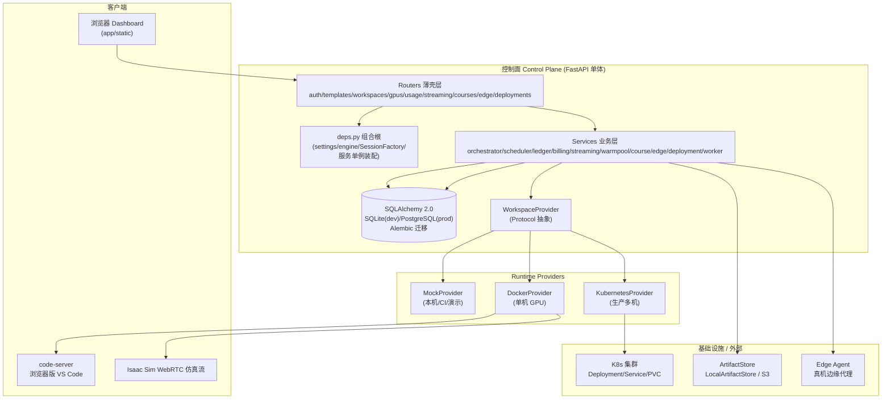
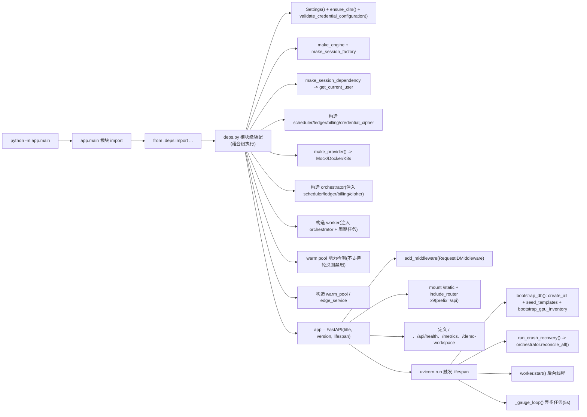
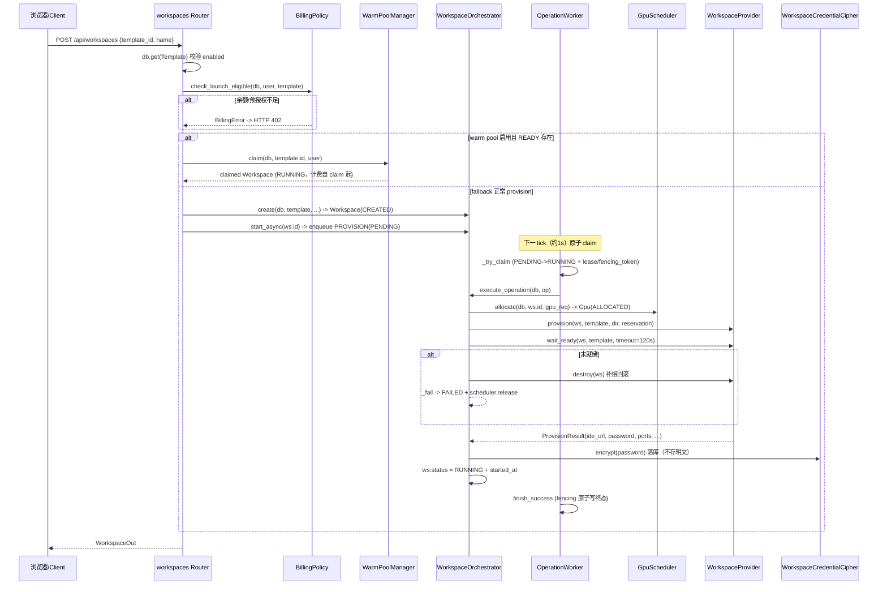
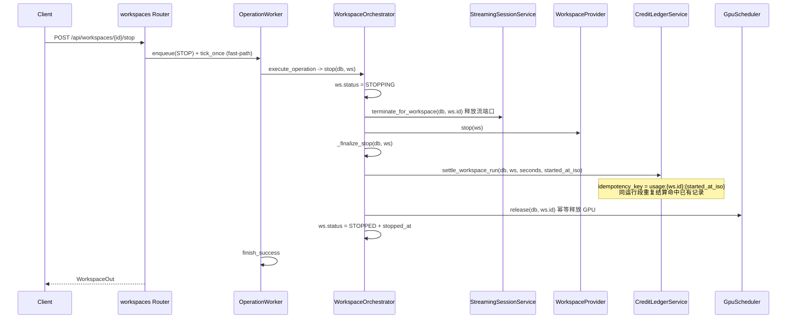
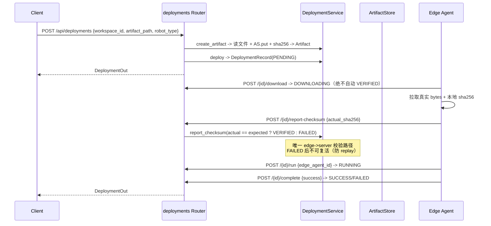
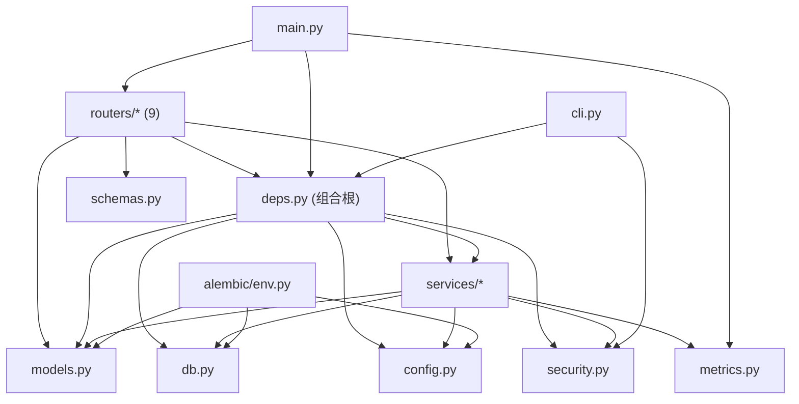

# EmbodiedCloud 架构走读报告

> 走读人：软件架构师（高见远）
> 日期：2026-08-13
> 仓库：`/Volumes/Extra/CodeProj/Embodied Cloud`
> 走读范围：`pyproject.toml` / `README.md` / `Makefile` / `alembic.ini` / `CHANGELOG.md` / `DELIVERY.md` / `MANIFEST.txt` / `.env.example`、`app/`（39 个 py 文件）、`alembic/`（10 级迁移链）、`deploy/`、`runtime/`、`scripts/`、`tests/`（结构）、`docs/`
> 版本：v0.3.0（代码事实源 `app/__init__.py`，`pyproject.toml` 与 `Makefile` 一致）

---

## 1. 项目整体架构总览

EmbodiedCloud 是一个「浏览器优先的 Isaac Lab 云 GPU 工作区」控制面（control plane），本质是一个 **FastAPI 单体 + 可插拔 Runtime Provider + 关系型数据库** 的系统。产品形态是：用户选一个「Golden Template」→ 平台在云端拉起一个带 GPU 的 Isaac Lab 工作区（浏览器版 code-server）→ 训练 → 停止结算 → 可选把 checkpoint 打包校验后部署到真机边缘代理（Sim2Real）。

技术栈（`pyproject.toml`）：Python ≥ 3.12、FastAPI + uvicorn、SQLAlchemy 2.0 + Alembic、pydantic-settings、prometheus-client、kubernetes client、cryptography（Fernet）、pyyaml。



架构要点一句话概括：**「Router 薄壳 → Service 业务逻辑 → Provider 运行时抽象」三层 + `deps.py` 组合根集中装配单例 + DB 持久化一切状态**。系统把「运行时」抽象成 `WorkspaceProvider` Protocol，用 Mock / Docker / K8s 三种实现切换演示与生产；把「GPU 分配」收敛到唯一入口 `GpuScheduler`；把「计费」做成 append-only 不可变账本；把「异步任务」做成 DB 持久化的 operation 队列（带 lease/fencing）。

---

## 2. 目录结构与模块职责表

### 2.1 app/ 目录结构

```
app/
├── __init__.py            # __version__ = "0.3.0"（版本单一来源）
├── main.py                # FastAPI 应用装配：lifespan、中间件、路由注册、run()
├── config.py              # Settings（pydantic-settings，env 前缀 EMBODIEDCLOUD_）
├── db.py                  # Base(DeclarativeBase)、make_engine、make_session_factory、session_dependency
├── deps.py                # 组合根：单例装配 + FastAPI 依赖（DB/CurrentUser/服务对象）
├── models.py              # 21 张表 ORM + 8 组状态枚举
├── schemas.py             # Pydantic 输入/输出模型（ORM BaseModel from_attributes）
├── security.py            # PBKDF2 密码哈希、session token、WorkspaceCredentialCipher
├── seed.py                # 5 个 Golden Template + TemplateVersion 种子
├── logging_setup.py       # RedactingFormatter + RequestIDMiddleware
├── metrics.py             # Prometheus Counter/Gauge/Histogram
├── cli.py                 # 管理 CLI：bootstrap-admin/list-gpus/show-usage/make-session
├── routers/               # 9 个路由模块（薄壳）
│   ├── auth.py            # 注册/登录/登出/me
│   ├── templates.py       # 模板目录（公开读）
│   ├── workspaces.py      # 工作区生命周期（含 /admin/all）
│   ├── gpus.py            # GPU inventory（admin）
│   ├── usage.py           # 用量 + 账本
│   ├── streaming.py       # 流式会话 + warm pool 观测
│   ├── courses.py         # 课程/实验/作业/提交
│   ├── edge.py            # 边缘代理注册/心跳/遥测
│   └── deployments.py     # Sim2Real 部署状态机
├── services/
│   ├── orchestrator.py    # Workspace 生命周期编排核心
│   ├── scheduler.py       # GPU 调度（inventory/allocate/release/recovery）
│   ├── ledger.py          # 不可变账本 CreditLedgerService
│   ├── billing.py         # BillingPolicy（启动门禁 + 配额）
│   ├── worker.py          # DB-backed OperationWorker（lease/fencing）
│   ├── warmpool.py        # WarmPoolManager（预热池 claim）
│   ├── streaming.py       # StreamingSessionService（状态机）
│   ├── course.py          # 课程业务逻辑（权限 + 流程）
│   ├── edge.py            # EdgeService + agent token 认证
│   ├── deployment.py      # DeploymentService（artifact + 部署状态机）
│   ├── artifact_store.py  # ArtifactStore 抽象（Local/S3）
│   ├── robot.py           # RobotDriver Protocol + MockRobotDriver
│   ├── ports.py           # TCP/UDP 端口探测与分配
│   └── providers/
│       ├── base.py        # WorkspaceProvider Protocol + ResourceReservation + RuntimeState
│       ├── mock.py        # MockProvider
│       ├── docker.py      # DockerProvider（单机 GPU）
│       └── k8s.py         # KubernetesProvider（多机）
└── static/                # 前端 Dashboard 静态资源
```

### 2.2 顶层目录职责表

| 路径 | 职责 | 关键文件 |
|---|---|---|
| `app/` | 控制面全部源码（39 个 py 文件） | `main.py`、`deps.py`、`models.py`、`services/` |
| `alembic/` | 数据库迁移（10 级线性链） | `env.py`、`versions/*.py` |
| `deploy/` | 部署清单（k8s YAML / compose / nginx） | `kubernetes/control-plane.yaml`、`docker-compose.control-plane.yml` |
| `runtime/` | 容器镜像与入口 | `Dockerfile.control-plane`、`Dockerfile.isaaclab-workspace`、`workspace-entrypoint.sh` |
| `scripts/` | 运维脚本与验收门禁 | `run_demo.sh`、`run_gpu_controlplane.sh`、`preflight_gpu_host.sh`、`gpu_acceptance.sh`、`release.sh`、`validate_release.py` |
| `tests/` | 38 个测试文件 + `conftest.py` + `k8s_fakes.py` | 覆盖调度/账本/worker/隔离/迁移等子系统 |
| `docs/` | 产品/架构/安全/ADR/验收文档 | `ARCHITECTURE.md`、`SECURITY.md`、`adr/0001~0003`、`CURRENT_STATE.md` |
| `.github/` | CI | `workflows/ci.yml` |

---

## 3. 核心入口文件与启动链路

### 3.1 启动入口

入口收敛在两个等价路径（`Makefile` + `pyproject.toml` `[project.scripts]`）：

- `make dev` → `.venv/bin/python -m uvicorn app.main:app --reload --port 8000`
- `embodiedcloud` 命令 / `python -m app.main` → `app.main:run()` → `uvicorn.run("app.main:app", host, port)`
- 容器：`CMD ["python", "-m", "app.main"]`（`runtime/Dockerfile.control-plane`）

### 3.2 完整启动链路（从 import 到服务装配）



关键事实（`app/deps.py`）：

1. **`deps.py` 是组合根（composition root）**：模块 import 时即完成全部单例装配——`settings`、`engine`、`SessionFactory`、`get_db`、`get_current_user`、`scheduler`、`ledger`、`billing`、`credential_cipher`、`provider`、`orchestrator`、`worker`、`warm_pool`、`edge_service`。设计意图在文件 docstring 明确写着「所有 router 从本模块取…避免 router 之间的循环导入」。
2. **`provider` 通过工厂 `make_provider()` 选择**（`deps.py:53-58`）：`docker` → `DockerProvider`，`k8s/kubernetes` → `KubernetesProvider`，其余（默认 `mock`）→ `MockProvider`。
3. **依赖注入**：FastAPI 的 `Depends` + `Annotated` 类型别名（`DB = Annotated[Session, Depends(get_db)]`、`CurrentUser = Annotated[User, Depends(get_current_user)]`），路由通过 `db: DB`、`user: CurrentUser` 声明依赖。
4. **lifespan**（`app/main.py:46-58`）：`bootstrap_db()`（开发建表 + 种子 + GPU inventory）→ `run_crash_recovery()`（基于 runtime 事实的幂等 reconcile）→ `worker.start()`（后台线程）→ 5s 周期刷新 Prometheus Gauge。

---

## 4. 配置管理体系

配置集中在 `app/config.py` 的 `Settings(BaseSettings)`，统一用 `pydantic-settings` 加载：

- **env 前缀** `EMBODIEDCLOUD_`、**env_file** `.env`、`case_sensitive=False`、`extra="ignore"`（`config.py:6-12`）。
- 所有配置项以类型注解声明并带默认值，天然成为「环境变量 → 配置对象」的映射。

配置分组与关键项（`config.py`）：

| 分组 | 关键配置 | 默认值 |
|---|---|---|
| runtime | `provider` / `database_url` / `public_base_url` / `bind_host` / `bind_port` / `auto_create_tables` | mock / sqlite:///./embodiedcloud.db / 0.0.0.0:8000 / true |
| workspace | `workspace_root` / `workspace_image` / `host_public_ip` / `ide_port_start~end` / `provision_ready_timeout_seconds` | /tmp/... / 18000~18999 / 120s |
| billing | `billing_enforce_preauthorization` / `billing_minimum_launch_minutes` | false / 5 |
| auth | `session_ttl_hours` / `password_pepper` / `workspace_credential_key` | 168 / "" / "" |
| observability | `log_json` / `log_level` | false / INFO |
| warm pool | `warm_pool_enabled` / `warm_pool_size` | false / 1 |
| k8s | `k8s_namespace` / `k8s_in_cluster` / `k8s_gpu_memory_mb` | embodiedcloud / false / 24576 |

配置管理特性与结论：

1. **生产安全校验**：`validate_credential_configuration(provider, credential_key)`（`security.py:169-179`）在 provider != mock 且未配置 `EMBODIEDCLOUD_WORKSPACE_CREDENTIAL_KEY` 时直接 `RuntimeError` 拒绝启动，禁止生产用开发默认密钥。
2. **`auto_create_tables` 双轨**：开发默认 `true`（`create_all`），生产 compose/k8s 注释要求走 alembic；但当前 `deploy/kubernetes/control-plane.yaml` 与 `deploy/docker-compose.control-plane.yml` 仍显式 `EMBODIEDCLOUD_AUTO_CREATE_TABLES: "true"`（见 §10 风险）。
3. **`ensure_dirs()`**（`config.py:65`）启动即建 `workspace_root`。
4. `.env.example` 提供完整可参考配置模板；数据库 URL 另在 `alembic/env.py` 以「env → ini → Settings 默认」三级优先级读取（`env.py:25-32`）。

---

## 5. 数据模型与数据库迁移演进

### 5.1 数据模型（`app/models.py`，21 张表）

| 领域 | 表 | 说明 |
|---|---|---|
| 身份/认证 | `organizations` / `users` / `user_sessions` | 组织-用户-会话；session 只存 token_hash |
| 模板 | `templates` / `template_versions` | 模板身份与不可变版本分离（UNIQUE(template_id, version)） |
| 工作区 | `workspaces` | 生命周期核心 + soft delete tombstone + warm_pool_state |
| GPU | `gpu_hosts` / `gpus` / `gpu_allocations` | 主机/GPU inventory + 运行时分配绑定 |
| 计费 | `credit_ledger` | 不可变账本，idempotency_key 唯一 |
| 异步操作 | `workspace_operations` | DB-backed 任务队列（lease/fencing） |
| 流式 | `streaming_sessions` | WebRTC 会话状态机 |
| 课程 | `courses` / `course_members` / `labs` / `assignments` / `submissions` | 高校教学 |
| 部署/边缘 | `artifacts` / `deployments` / `edge_agents` / `telemetry_events` | Sim2Real 产物/部署/边缘代理 |

模型要点：

- 所有主键/外键均为 **String(36) UUID**（应用层生成，非 DB 自增），`id = str(uuid.uuid4())`。
- 状态字段用 `StrEnum` 定义（`WorkspaceStatus`、`GpuStatus`、`LedgerType`、`StreamingStatus`、`Role`、`DeploymentStatus`、`AgentStatus`、`OperationStatus`、`WarmPoolState`），存字符串 `.value`。
- 关键并发约束：`gpu_allocations.workspace_id` 唯一 + `gpus.workspace_id` 唯一（`uq_gpus_workspace`）→ 「一个 workspace 至多一张 GPU」；`workspace_operations` 的部分唯一索引 `uq_ops_active_per_workspace`（SQLite/PostgreSQL 双 where）→ 「同 workspace 至多一个 active operation」。

### 5.2 迁移演进（`alembic/versions/`，10 级线性链）

| 迁移 | 内容 |
|---|---|
| `572b9ffa9375` initial | 初始 schema（21 表） |
| `a359de4e4d50` | 新增 `workspace_operations`（durable operation 化） |
| `eacad364347f` | `workspaces.deleted_at` soft delete tombstone |
| `d19abc033347` | 新增 `template_versions` + `workspaces.template_version_id/image` |
| `bf8d0efb276f` | `workspaces.warm_pool_state` |
| `9a56191f3f4c` | `workspace_operations` 增加 lease_owner/fencing_token/heartbeat_at |
| `1cfd55439fd3` | `artifacts` 增加 object_key/content_type/store_name（对象存储化） |
| `93cc4735342a` | `templates.current_version_id`（确定性版本指针） |
| `c7c6f510d21f` | `edge_agents.owner_user_id/organization_id`（租户归属） |
| `87c6c7d2d168` | `uq_ops_active_per_workspace` 部分唯一索引 |

演进主线清晰：**先建完整领域模型 → 逐步引入「持久化异步任务 + lease/fencing」「模板不可变版本化」「warm pool 状态机」「对象存储解耦」「边缘代理租户归属」** 等正确性/安全加固。

两个值得注意的迁移事实：

1. **SQLite 缺 FK**：`c7c6f510d21f` 注释明确「SQLite 不支持 ALTER 加 FK」，`edge_agents.owner_user_id/organization_id` 在 SQLite 下无数据库级外键，靠应用层校验；PostgreSQL 由 autogenerate 原生支持。相关 tech debt 见 `docs/CURRENT_STATE.md`「SQLite FK 约束（§30，batch migration 待做）」。
2. **SQLite 部分唯一索引**：`87c6c7d2d168` 用 `sqlite_where`/`postgresql_where` 同时声明，保证双库语义一致。

---

## 6. 业务模块划分与各模块职责

### 6.1 核心编排：Workspace 生命周期（`services/orchestrator.py`）

`WorkspaceOrchestrator` 是系统心脏，串联所有领域服务：

- **create**：绑定不可变 `TemplateVersion`（`current_version_id` 指针 → released 兜底），快照 `workspace.image`。
- **provision**（`_execute_provision`）：`scheduler.allocate`（唯一 GPU 决策）→ 构造 `ResourceReservation` → `provider.provision` → `provider.wait_ready`（readiness gate，未就绪回滚 destroy + release）→ 加密凭据落库 → RUNNING。
- **stop/destroy**：`streaming.terminate → provider.stop/destroy → ledger 结算 → scheduler.release → STOPPED/DELETED(tombstone)`，全幂等。
- **reconcile_all**：DB 状态向 runtime 事实收敛（ALIVE adopt / MISSING settle+release+FAILED / 未起 requeue），启动 recovery 与 RECONCILE operation 共用。
- **monitor_runtime_quotas**：RUNNING workspace 投影余额/课程配额透支 → 优雅停止。

### 6.2 各模块职责一览

| 模块 | 职责 | 关键设计 |
|---|---|---|
| 调度 `scheduler.py` | GPU inventory 同步 + 原子分配/释放 + crash recovery | `SELECT...FOR UPDATE skip_locked` + 唯一约束兜底；UNHEALTHY/DRAINING 不调度 |
| 账本 `ledger.py` | append-only CreditLedger | 永不 UPDATE/DELETE；idempotency_key 防重复扣款；balance=SUM(amount) |
| 计费 `billing.py` | 启动门禁 + 课程配额 | 个人+组织余额 < 0 拒绝；预授权（N 分钟×60）；admin/instructor 豁免 |
| 异步 `worker.py` | DB-backed operation 队列 | 原子 claim（rowcount==1）、lease 60s、心跳 15s、fencing_token 防双终态、指数退避重试 |
| 预热池 `warmpool.py` | warm workspace 预热与原子 claim | PREWARMING→READY→CLAIMING→CLAIMED；claim 后轮换凭据，失败完整补偿 |
| 流式 `streaming.py` | WebRTC 会话状态机 | 合法迁移表驱动；owner 隔离 |
| 课程 `course.py` | 教学流程 | 教师/学生权限模型，非 member 404 |
| 边缘 `edge.py` | Edge Agent 注册/心跳/遥测 + token 认证 | 原始 token 仅返回一次；只存 hash；租户 scope |
| 部署 `deployment.py` | artifact + 部署状态机 | pending→downloading→verified→running→success/failed；checksum 防绕过/防 replay |
| 对象存储 `artifact_store.py` | 对象存储抽象 | Local / S3 兼容；`_safe_key` 防 path traversal |
| 机器人 `robot.py` | 真机驱动抽象 | `RobotDriver` Protocol + Mock 回环（明确 PHYSICAL_VALIDATION_PENDING） |
| Provider `providers/` | 运行时抽象三实现 | `ResourceReservation` 是唯一 GPU 决策来源，provider 禁止自选 GPU |

### 6.3 Provider 抽象（`services/providers/base.py`）

`WorkspaceProvider` 是 Protocol（结构化鸭子类型），统一契约：`health/provision/start/stop/destroy/inspect/logs/reconcile/wait_ready/rotate_credentials` + `supports_credential_rotation` 属性。

- **MockProvider**：无真实 runtime，`reconcile` 返回 UNKNOWN，`wait_ready` 恒 True，用于本地/CI/演示（`deps.bootstrap_gpu_inventory` 为 mock 造 8 张虚拟 GPU）。
- **DockerProvider**：单机 `--gpus device=N`（严格来自 reservation）、`--network host`、bind mount 0o777（ADR 0003 明确的可信单机模式）、IDE 动态端口 + WebRTC 固定端口单槽位；`supports_credential_rotation=False`（容器 env 不可变）→ warm pool 自动禁用。
- **KubernetesProvider**：每 workspace 一组 Deployment + Service + PVC，非 privileged、非 hostNetwork、`nodeSelector` 由 `reservation.node_name` 构造、`nvidia.com/gpu` limit 来自 reservation；支持凭据轮换（patch env → 滚动重启）。kubernetes SDK **懒加载**，offline 测试注入 fake client/model。

---

## 7. 关键请求的调用链 / 数据流

### 7.1 链路 A：创建并启动工作区（create → provision → RUNNING）



数据流要点：`Workspace` 状态 `CREATED → QUEUED → PROVISIONING → RUNNING`（`_execute_provision` 内部流转），GPU 决策只发生在 `scheduler.allocate`，provider 只执行 `ResourceReservation`。

### 7.2 链路 B：停止并结算（stop → settle → release）



数据流要点：结算基于 `started_at → now` 的真实运行秒数，账本记录 `amount=-seconds`（1 秒 = 1 credit），`gpu_seconds` 字段落库；同一运行段的幂等键保证「重启重放不重复扣费」。

### 7.3 链路 C：Sim2Real 部署（deploy → edge 校验 → run）



数据流要点：checksum 由控制面登记、edge 端实际校验并上报，server 只比较 `actual == expected`，客户端不能直接提交 `VERIFIED`（防绕过）；`run` 只能绑定租户自己的 agent。

---

## 8. 模块间依赖关系

### 8.1 内部依赖图



依赖方向总体自顶向下：`routers → services → models/db/config`，无反向依赖。

### 8.2 循环依赖检查结论

**未发现模块级循环依赖**。关键解耦手段：

- `deps.py` 作为「组合根」集中装配，router 只 `from ..deps import ...`，避免 router 间互相 import（`deps.py` docstring 明示）。
- `orchestrator.py → worker.py`（单向：`from .worker import enqueue_operation`）；`worker.py` 不反向 import orchestrator（通过 `executor` 参数注入 `execute_operation` 回调，依赖倒置）。
- `warmpool.py → orchestrator` 用 `if TYPE_CHECKING` 隔离，仅类型提示期引用，避免运行时环。
- `k8s.py` 顶层不 import kubernetes SDK（懒加载），保证 mock 模式下 `from app.deps import provider` 不触发重量级依赖。

### 8.3 跨层违规与一致性瑕疵（重点发现）

1. **【P1 跨层违规】`routers/deployments.py` 绕过了共享组合根**（`deployments.py:20-31`）：它没有 `from ..deps import DB, CurrentUser`，而是在模块内重新 `Settings()` + `make_engine` + `make_session_factory` + 本地 `DB`/`CurrentUser` 依赖 + 本地 `DeploymentService(_settings.workspace_root)`。这导致：
   - 系统中存在 **第二个 Settings 实例、第二个 engine、第二个 session factory**，与 `deps.py` 的 `SessionFactory` 非同一连接池对象（SQLAlchemy 按 URL 共享底层连接，但生命周期/配置不再单一来源）。
   - 代码注释自认原因「deps 模块存在既有 mypy 错误且不在本任务修改范围」——本质是**技术债驱动的架构分叉**，破坏了「组合根统一装配」约定。
   - 后果：`deployments` 路由的 `deployment_service` 使用的 `workspace_root`/`store` 与 orchestrator 无关，未来若 `deps` 调整配置或注入 S3 store，deployments 路由不会同步，易产生配置漂移。

2. **【P2 重复装配】`routers/streaming.py` 在模块级再建服务实例**（`streaming.py:15-16`）：`_service = StreamingSessionService(SessionFactory)`、`_warmpool = WarmPoolManager(SessionFactory, orchestrator, settings)`。`deps.py` 已有 `warm_pool` 单例、`orchestrator` 内部也自建 `StreamingSessionService`，导致同一领域服务存在多份实例（虽均为无状态/轻状态，但破坏了单例一致性心智模型）。

3. **【P2 配置不一致】`orchestrator.monitor_runtime_quotas` 硬编码新 BillingPolicy**（`orchestrator.py:498-501`）：配额监控循环内重新 `BillingPolicy(session_factory, ledger, minimum_launch_minutes=5, enforce_preauthorization=False)`，而非复用注入的 `self.billing`，使监控路径的计费参数与启动门禁路径可能不一致（若生产配置了预授权，监控仍按关闭状态计算）。

---

## 9. 架构模式识别

| 模式 | 体现 | 位置 |
|---|---|---|
| **分层架构** | Router（薄壳）→ Service（业务）→ Provider/Model（底层抽象） | 全 `app/` |
| **组合根（Composition Root）+ 依赖注入** | 单例集中装配 + `Depends`/`Annotated` 注入 | `deps.py` |
| **工厂模式** | `make_provider()` 按配置选择 provider | `deps.py:53` |
| **策略模式（Protocol 多态）** | `WorkspaceProvider` / `ArtifactStore` / `RobotDriver` 三个 Protocol | `providers/base.py`、`artifact_store.py`、`robot.py` |
| **状态机模式** | Workspace/Streaming/WarmPool/Deployment/Operation 多套状态机；Streaming 用「合法迁移表」驱动 | `orchestrator.py`、`streaming.py`、`warmpool.py`、`deployment.py`、`worker.py` |
| **不可变事件溯源式账本** | append-only CreditLedger + 幂等键（非严格事件溯源，但共享「只增不改」思想） | `ledger.py` |
| **DB-backed 任务队列 + Lease/Fencing** | 持久化 operation + 原子 claim + 心跳 + fencing_token 防双终态 | `worker.py`、`models.WorkspaceOperation` |
| **软删除 Tombstone** | `deleted_at` 保留行用于审计/计费 | `workspaces.deleted_at` |
| **补偿事务（Saga 风格）** | provision 失败 destroy+release、warm pool claim 失败完整补偿 | `orchestrator.py`、`warmpool.py` |
| **中间件模式** | `RequestIDMiddleware`、`RedactingFormatter` 脱敏 | `logging_setup.py` |

**未使用的模式**（如实说明）：
- **无 Repository 层**：Service 直接使用 SQLAlchemy `Session`/`select`，未抽象仓储（对当前规模合理，见 §10 P2）。
- **无 Mixin**：`schemas.ORM` 是单一基类（`from_attributes=True`），非 Mixin 组合。
- **无显式 CQRS/事件总线**：命令与查询同库同模型。

---

## 10. 架构层面的风险与改进点（P0/P1/P2 分级）

### P0（架构级正确性缺陷，需立即处理）

> 经完整走读，**未发现会导致数据损坏/越权/重复计费的 P0 架构缺陷**。计费幂等、GPU 单一权威、operation fencing、owner/org 隔离、checksum 防绕过等关键正确性约束均由「代码 + 数据库约束 + 测试」三重保障。P0 项空缺本身即结论。

### P1（高优先级架构债/风险，建议尽快处理）

1. **【跨层违规】deployments 路由自建第二套配置/引擎/会话**（`routers/deployments.py:20-31`）。
   破坏了 `deps.py` 组合根的单一来源原则，是配置漂移与依赖分叉的隐患。**建议**：修复 `deps` 的 mypy 问题后，让 deployments 路由改回 `from ..deps import DB, CurrentUser, settings`，并从组合根注入 `DeploymentService`。

2. **【生产部署与迁移体系脱节】K8s/compose 清单仍用 `AUTO_CREATE_TABLES=true` + `emptyDir`**（`deploy/kubernetes/control-plane.yaml:24`、`deploy/docker-compose.control-plane.yml:14`）。
   生产应关闭 `auto_create_tables` 走 alembic，且 SQLite 放在 `emptyDir` 意味着 Pod 重启数据即丢失。清单自注「Development skeleton only」，但作为唯一「生产」参考存在误导。**建议**：提供 PostgreSQL + PersistentVolume + `migrate-up` 的生产模板。

3. **【artifact 接入仍耦合控制面本地文件系统】`DeploymentService.create_artifact` 直接读 `workspace_root/{ws.id}/path`**（`deployment.py:82-91`）。
   这与 `artifact_store.py` docstring 宣称的「生产逻辑不得依赖控制面直接读取每个 Workspace PVC」矛盾。K8s 模式下 workspace 产出在 Pod 内 PVC，控制面主机读不到该文件，`create_artifact` 会 404 失败。**建议**：提供「edge/workspace 侧上传 + 服务端只校验」的产物接入路径，或由 provider 暴露 `pull_artifact` 契约。

4. **【SQLite 与生产库的能力缺口被默认配置掩盖】** SQLite 下 `with_for_update(skip_locked)` 为 no-op、部分 FK 未建（`c7c6f510d21f` 注释）。并发正确性在 SQLite 靠「唯一约束兜底」勉强成立，但生产必须 PostgreSQL 才能获得完整行锁/FK 语义。**建议**：文档与 CI 中明确「生产仅支持 PostgreSQL」，并将关键并发测试跑在 PostgreSQL 容器上。

### P2（中低优先级，随迭代优化）

1. **全局单线程 worker 吞吐瓶颈**：`OperationWorker` 是单后台线程，`tick_once` 内同步执行 provision（含最长 120s 的 `wait_ready`），会阻塞队列中其余 operation（`worker.py`）。并发创建大量 workspace 时排队延迟明显。**建议**：provision 改为多 worker + 每 operation 独立线程/协程，或 `wait_ready` 阶段释放队列循环。

2. **`reconcile_all` 的 O(N) 开销**：启动/每次 RECONCILE 全表扫描 workspace 并对每个调 `provider.reconcile/inspect`（`orchestrator.py:377-460`），Docker 下每 workspace 多次 `docker inspect` 子进程调用。**建议**：按 provider 批量 inspect 或增量 reconcile。

3. **服务实例重复装配**：`streaming.py` 模块级自建 `StreamingSessionService`/`WarmPoolManager`（`streaming.py:15-16`）与组合根实例并存。**建议**：统一由 `deps.py` 暴露，router 只消费单例。

4. **配额监控硬编码计费参数**：`monitor_runtime_quotas` 内重建 `BillingPolicy(..., minimum_launch_minutes=5, enforce_preauthorization=False)`（`orchestrator.py:498-501`），与注入的 `self.billing` 可能不一致。**建议**：复用 `self.billing`。

5. **demo 端点无鉴权**：`GET /demo-workspace/{workspace_id}`（`main.py:105`）不校验 owner、渲染 workspace name 与 template launch_command，虽仅 mock 演示用，但 URL 可枚举，存在轻微信息泄露。**建议**：加 owner 校验或限定 `provider==mock` 才挂载。

6. **无 Repository 层**：Service 直接操作 SQLAlchemy Session，业务逻辑与 ORM 查询耦合。当前规模可接受；若业务复杂度继续增长（尤其 billing/计费），建议引入 Repository/QueryObject 隔离。

---

## 附：总体评价

EmbodiedCloud 的架构在「控制面」维度上质量较高：分层清晰、Provider 抽象干净、GPU 单一权威 + 不可变账本 + DB-backed 可重放任务队列 + 模板不可变版本化，形成了一套**以正确性优先、可离线单测**的设计（测试目录 38 个文件与 `k8s_fakes.py` 离线注入即是明证）。ADR（0001~0003）与 SECURITY 文档把「哪些是刻意设计（盲捕获、单机可信模式）」显式固化，避免了后续维护者的误判。

主要扣分点集中在**部署/生产化与「唯一事实源」的一致性**：deployments 路由的二次装配、生产清单仍开 `auto_create_tables` + emptyDir、artifact 接入与「控制面不读 PVC」原则的背离，以及 worker 单线程串行化——这些不是正确性 bug，但会显著影响从「本地演示可跑」到「多机生产可用」的跨越，建议作为下一迭代的架构重点。
